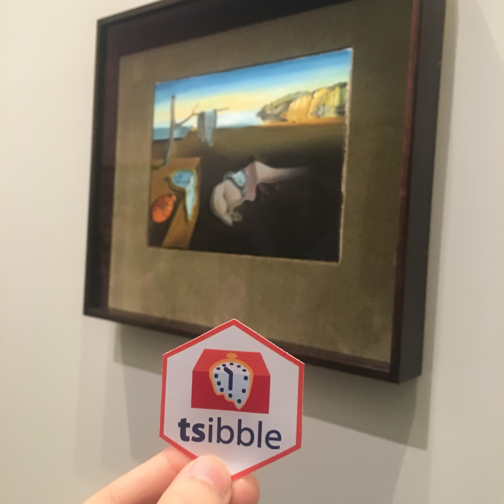

```{r initial, echo = FALSE, cache = FALSE, results = 'hide'}
library(knitr)
options(htmltools.dir.version = FALSE, tibble.width = 60, tibble.print_min = 6)
opts_chunk$set(
  echo = FALSE, warning = FALSE, message = FALSE, comment = "#>",
  fig.path = 'figure/', cache.path = 'cache/', fig.align = 'center', 
  fig.width = 12, fig.show = 'hold', fig.height = 8.5,
  cache = TRUE, external = TRUE, dev = 'svglite'
)
read_chunk('R/theme.R')
read_chunk('R/code.R')
```

```{r theme-remark}
```

```{r load-pkgs}
```

```{r load-data}
```

```{r map-airlines, fig.width = 12, fig.height = 8, fig.show = "hide"}
```

background-image: url(`r fig_chunk("map-airlines", "svg")`)
background-size: cover

class: bottom center

# US airline traffic in 2017

*data source: [US Bureau of Transportation Statistics](https://www.transtats.bts.gov/DL_SelectFields.asp?Table_ID=236)*

???

wild data

---

.left-column[
<br>
<br>
<br>
<br>
<br>
<br>
<br>
## A glimpse
]
.right-column[
```{r glimpse, echo = TRUE}
```
]

???

the data set is spectacular, fine resolution

---

.pull-left[
* heterogeneous data types
* irregular time interval
]
.pull-right[
* multiple measured variables
* multiple grouping variables
]
```{r print}
```

---

.pull-left[
<br>
<br>
<br>
<br>
<br>
<br>
<br>
## Get ready for time series analysis?
]

--

.pull-right[
<br>
<br>
<br>
<br>
<br>
This data set doesn't fit into:

.x[
* `ts()`
* `zoo()`
* `xts()`
]

The underlying structure is a matrix of numeric data with an implicit time index.
]

---

.pull-left[
<br>
<br>
<br>
<br>
<br>
<br>
<br>
## Get ready for time series analysis?
]

.pull-right[
<br>
<br>
<br>
<br>
<br>
.animated.hinge[
This data set doesn't fit into:

.x[
* `ts()`
* `zoo()`
* `xts()`
]

The underlying structure is a matrix of numeric data with an implicit time index.
]
]

---

.pull-left[
<br>
<br>
<br>
<br>
<br>
<br>
<br>
## Get ready for time series analysis?
]

.pull-right[
<br>
<br>
<br>
<br>
.animated.bounceInDown[
.center[]
]
]

---

class: inverse middle center

.animated.fadeIn[

]

---

.left-column[
## What makes a tsibble?
### - index
]
.right-column[
```{r tsibble, echo = TRUE}
```
* Supported index types:
  + `POSIXct`, `Date` & `nanotime`
  + `yearweek`, `yearmonth` & `yearquarter`
  + `integer`/`double`
* Extensible: define `index_valid()` for custom types
]

---

.left-column[
## What makes a tsibble?
### - index
### - key
]
.right-column[
What's your observational unit over time?

```{r tsibble, echo = TRUE}
```

* Key created via `id()` (identifier)
  + *empty:* univariate time series (implicitit key)
  + *single:* univariate or multivariate time series
  + *multiple:* nested and crossed structures

**tsibble is strict: dinstinct rows identified by index and key.** Use `validate = FALSE` to skip the checks, if you're sure it's a valid input.
]

---

.left-column[
## What makes a tsibble?
### - index
### - key
### - interval
]
.right-column[
Free from specifying time frequency

```{r tsibble, echo = TRUE}
```

When `regular = TRUE` (by default), it automatically recognizes the time interval based on the index representation from year to day, to nanosecond.

But if you wanna specify the interval, check out the low-level constructor `build_tsibble()`.
]

---

.left-column[
## What makes a tsibble?
### - index
### - key
### - interval
### - tsibble
]
.right-column[
**Arranging the key and index from past to future**
```{r print-tsibble, echo = TRUE}
```
]

---

class: inverse middle center


## standing on the shoulders of giants

.animated.bounceInRight[
```{r tidyverse, comment = ""}
tidyverse::tidyverse_logo()
```
]

---

.left-column[
## Verbs
### - filter
]
.right-column[
```{r filter, echo = TRUE}
```
]

---

.left-column[
## Verbs
### - filter
### - select
]
.right-column[
```{r select, echo = TRUE}
```
]

---

.left-column[
## Verbs
### - filter
### - select
### - summarise
]
.right-column[
```{r summarise, echo = TRUE}
```
]

---

.left-column[
## Verbs
### - filter
### - select
### - summarise
### - index_by
]
.right-column[
```{r index-by, echo = TRUE}
```
* `year()` for yearly aggregation, `yearquarter()` for quarterly, `yearmonth()` for monthly, `yearweek()` for weekly
* a few lubridate friends
]

---

## Pipeline

```{r quantile, echo = TRUE}
```

---

```{r draw-qtl, fig.height = 7}
```

---

## Pipeline

```{r carrier, echo = TRUE}
```

---

```{r carrier-plot, fig.height = 7}
```

---

## Roadmap

---

class: inverse middle center

### Slides created via xaringan `r emo::ji("crossed_swords")` <http://slides.earo.me/isu18>

### Open source <https://github.com/earowang/isu18>

### This work is under licensed [`r icon::fa("creative-commons")` BY-NC 4.0](https://creativecommons.org/licenses/by-nc/4.0/).
